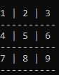

# tic-tac-toe

## Table of Contents

* [About the Project](#about-the-project)
  * [Built With](#built-with)
* [Getting started](#Getting-started)
* [How to play](#How-to-play)
* [Contact](#contact)
* [Acknowledgements](#acknowledgements)

<!-- ABOUT THE PROJECT -->
## About The Project

This is a project where you can play the Tic-Tac-Toe game, (builded with Ruby language), for two players, who take turns for drawing X or O in spaces of a 3×3 board. The player who first place three of their marks in a horizontal, vertical, or diagonal row is the winner. 

### Built With

* [RUBY]()

## Getting started

1. Clone or download the project in the repository.
2. Acess to the name of folder with your terminal commands.
3. Run this instruction: bin/main.rb 

## How to play
1. Once you initialize the game, it will ask you for two names: Player1 and Player2. Player1 will get the first turn and the sign 'X' and Player2 will get the second turn and the sign 'O".
2. The board is displayed in the screen and the game will ask the Player1 to type a move from numbers 1 to 9 representing the cells of the board. If you choose another number, or character, the game will display an alert, and will ask you to select a valid move.
3. For a win you need to place three of their marks in a horizontal, vertical, or diagonal row. If no player won and there are no available spots in the board, the game will display a tie.
4. The game will display the result: win or tie, and gives you the option of play again or end the game. 

<!-- CONTACT -->
## Contact

Melissa Castorena - mcastorena0316@gmail.com

Guadalupe Rangel- kanemekanik@gmail.com

Project Link: [Tic-Tac-Toe]()

<!-- ACKNOWLEDGEMENTS -->
## Acknowledgements

* [Microverse](https://www.microverse.org/)